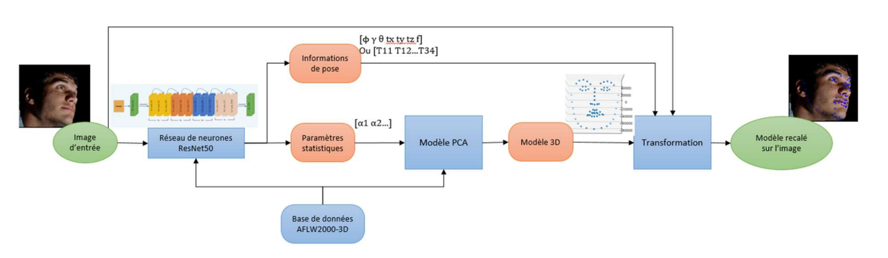
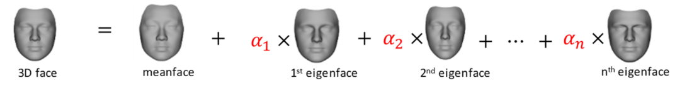
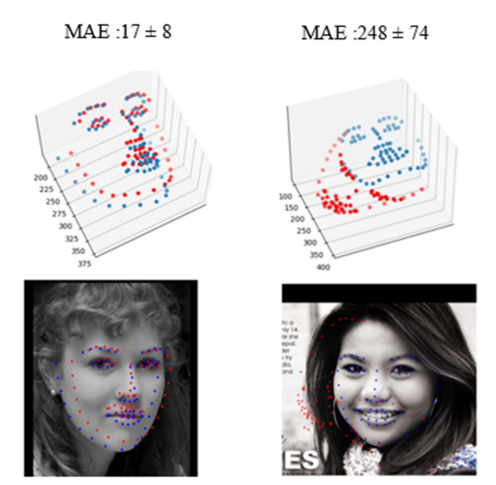
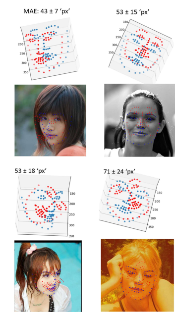
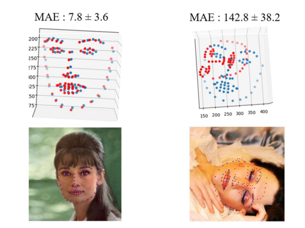
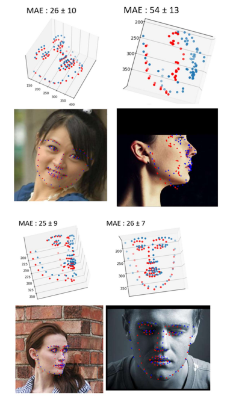

# Génération et recalage de modèle 3D de visage à partir d'une image

## Résumé

Le but de ce projet est de générer un modèle 3D d'un visage à partir d'une seule photo de ce dernier et de placer ce modèle sur la photo en respectant la position et l'orientation du visage. 
La suite de ce README présente un résumé du projet. Pour avoir plus d'informations portant sur le choix des solutions techniques ou plus de détails sur les expérimentations et resultats, consulter le [rapport de projet](https://github.com/kevinbecquet/reconstruction-faciale/blob/main/G%C3%A9n%C3%A9ration%20et%20recalage%20de%20mod%C3%A8les%203D%20de%20visages%20%C3%A0%20partir%20d'%20images.pdf).

## Méthode utilisée

Pour réaliser ce projet, il a été décidé de suivre une méthode très établie dans la littérature telle que présenté par (Nguyen et al., 2022). On utilise un modèle PCA pour décrire le modèle de visage en un nombre réduit de paramètres statistiques puis on estime ces paramètres statistiques ainsi que les informations de pose (position et rotation du modèle 3D par rapport au visage dans l'image) à l'aide d'un réseau de neurones ResNet-50. 

## Données

La base de données utilisée dans ce projet est AFLW2000-3D. Elle contient:

- des images de visages de tailles 450x450 px
- leurs informations de pose sous la forme d'un vecteur contenant les angles de tangage, roulis et lacet, les translations suivant x, y et z et un facteur de scaling
- les modèles 3D correspondant à ces visages orientés de la même direction que ces dernier

Les informations de cette base de données ont été condensées dans un seul fichier .csv 

### Modèle PCA

Le modèle PCA est construit à partir des modèles 3D des visages. L'utilité de ce modèle est de pouvoir décrire le visage avec uniquement un set de paramètres (les α de l'image ci dessous) plutôt qu'en utilisant tous les points 3D du visage. 

Une fois créé et testé le modèle PCA extrait les paramètres statistiques de chaque visage. 

### Estimation des paramètres dans l'image

On estime les paramètres statistiques du visage et sa pose dans l'image à l'aide d'un ResNet-50. Il prend donc en entrée une image et ressort un vecteur composé des informations de pose et des paramètres statistiques. 

En suivant les travaux de (Guo et al., 2020), deux méthodes différentes de représentations de la pose ont été utilisées : 
- un vecteur de pose reprenant directement les informations de AFLW2000-3D où l'orientation est exprimées suivant des angles d'Euler, représentation plus courte mais introduisant le problème de Gimbal Lock
- une matrice de transformation exprimant de manière plus explicite la rotation au prix d'un plus grand nombre de paramètres à retrouver (12 au lieu des 7 du vecteur de pose) 
   
L'entraînement est effectué à l'aide d'une MSE pour la fonction de perte, un taux d'apprentissage de 0.001 diminuant de 10% par epoch à partir de l'epoch 10. 

Il s'arrête après 200 epochs ou lorsque l'on ne remarque plus d'amélioration de la fonction de perte après 5 epochs consécutives. 

## Résultats

Voici quelques images des résultats de reconstruction que l'on obtient sur la base de données AFLW2000-3D en utilisant le vecteur de pose  ou la matrice de transformation pour représenter la pose.   

Les erreurs représentés sur calculées sur la distance entre chaque point du modèle reconstruit à l'aide des paramètres estimés par le ResNet50 et les modèles de référence. 

### Vecteur de pose

Pour cet entrainement on obtient une erreur moyenne de 59.7 ± 32.7 px 

Voici les erreurs minimale et maximale de reconstruction obtenues sur la base de test

Voici quelques exemples situés autout de la moyenne d'erreur obtenue sur la base de test

### Matrice de transformation 
Pour cet entrainement on obtient une erreur moyenne de 29.4 ± 16.4 px 

Voici les erreurs minimale et maximale de reconstruction obtenues sur la base de test

Voici quelques exemples situés autout de la moyenne d'erreur obtenue sur la base de test

## Discussion

La matrice de transformation semble donc bien plus intéressante. On y retrouve une erreur plus faible que lors de l'utilisation de vecteurs de pose. Cela confirme le fait que le phénomère de Gimbal Lock crée de la confusion dans le réseau l'empêchant de bien apprendre des données d'entraînement.
